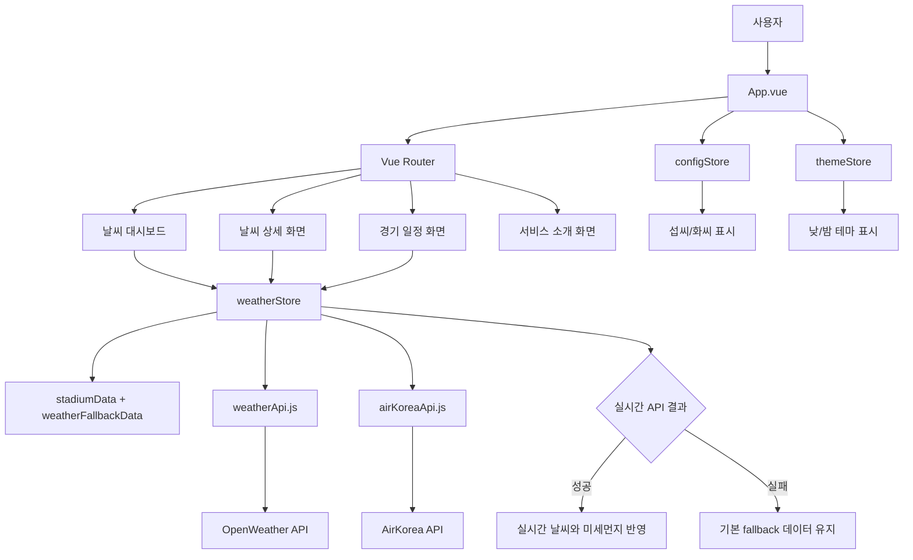

# BASEBALL WEATHER

## 1. 프로그램 목적과 기능 소개

BASEBALL WEATHER는 국내 야구 경기장 주변의 날씨와 미세먼지 정보를 확인하고, 당일 야구 경기 일정을 함께 조회할 수 있는 Vue 기반 웹 애플리케이션입니다.

### 주요 기능

- 국내 주요 야구 경기장별 현재 날씨 조회
- 경기장 주소를 기준으로 한 실시간 기상 정보 제공
- AirKorea 측정소 기준 미세먼지 상태 제공
- 도시명, 주소, 경기장명으로 날씨 카드 검색
- 평균 기온 및 지역별 상세 기상 정보 표시
- 섭씨/화씨 단위 전환
- 낮/밤 테마 전환
- 오늘의 야구 경기 일정 및 경기 상태 표시
- 비가 오는 지역의 경기를 우천 취소 상태로 표시
- API 호출 실패 시 기본 fallback 데이터 표시

## 2. 프로그램 실행 환경과 실행 방법

### 배포 사이트

별도의 설치 없이 [BASEBALL WEATHER](https://skala-vue-tawny-eight.vercel.app)에 접속하여 바로 사용할 수 있습니다.

### 실행 환경

- Node.js `20.19.0` 이상 또는 `22.12.0` 이상
- npm
- 최신 웹 브라우저
- OpenWeather API 키
- AirKorea 공공데이터 API 키

### 설치 및 실행

```bash
npm install
npm run dev
```

개발 서버 실행 후 터미널에 표시되는 주소로 접속합니다. 기본적으로 Vite 개발 서버 주소는 `http://localhost:5173`입니다.

### 환경변수 설정

프로젝트 루트에 `.env` 파일을 만들고 다음 값을 설정합니다.

```env
VITE_OPENWEATHER_API_KEY=발급받은_OpenWeather_API_키
VITE_AIRKOREA_API_KEY=발급받은_AirKorea_API_키
```

환경변수를 설정하지 않거나 실시간 API 호출에 실패하면 애플리케이션은 기본 날씨 데이터를 표시합니다. API 키가 포함된 `.env` 파일은 저장소에 커밋하지 않습니다.

### 빌드 및 미리보기

```bash
npm run build
npm run preview
```

## 3. 프로그램 구조

```text
skala-vue/
├── index.html # 애플리케이션 진입 HTML
├── package.json # 의존성 및 실행 스크립트
├── vite.config.js # Vite 설정
├── public/ # 정적 파일
└── src/
├── App.vue # 공통 레이아웃, 내비게이션, 테마/단위 제어
├── main.js # Vue, Pinia, Router 애플리케이션 초기화
├── api/
│ ├── weatherApi.js # OpenWeather 위치/날씨/공기질 API 연동
│ └── airKoreaApi.js # AirKorea 미세먼지 API 연동
├── assets/
│ ├── base.css # 공통 스타일
│ ├── exercise.css # 컴포넌트 스타일
│ └── main.css # 전역 스타일
├── components/exercise/
│ ├── BaseDashboardCard.vue
│ ├── SearchBar.vue
│ ├── UnitToggler.vue
│ └── WeatherCard.vue
├── data/
│ ├── baseballData.js # 경기 일정 및 팀 정보
│ ├── stadiumData.js # 경기장, 주소, 측정소 정보
│ └── weatherFallbackData.js # API 실패 시 기본 날씨 정보
├── router/index.js # 화면별 라우팅 설정
├── stores/
│ ├── configStore.js # 온도 단위 설정
│ ├── themeStore.js # 낮/밤 테마 설정
│ └── weatherStore.js # 날씨 데이터 및 API 상태 관리
└── views/
├── WeatherHomeView.vue # 지역별 날씨 대시보드
├── WeatherDetailView.vue # 지역별 상세 날씨
├── GameScheduleList.vue # 오늘의 야구 경기 일정
├── WeatherAboutView.vue # 서비스 소개
└── NotFoundView.vue # 존재하지 않는 경로
```

## 4. 프로그램 구조도



## 5. 세부 구현 과정

### 5-0. Project Scaffolding

1. https://github.com/bottletiger/skala-vue.git 을 fork하고(https://github.com/iihlolo/skala-vue.git) 로컬에 clone했습니다.
2. SKALA-VUE(http://localhost:3000/)에 접속하여 AboutView를 확인했습니다.
3. Vue Devtools : Overview, Components, Pages Timeline, Assets, Router, Pinia, Graph, Inspect / Search의 기능을 확인했습니다.

### 5-1. Weather Mockup

#### 구현 과정

1. **가상 날씨 데이터 구성**

- API 연동 전 날씨 대시보드의 화면과 사용자 상호작용을 확인하기 위해 가상의 날씨 데이터를 구성했습니다.
- 서울, 인천, 대전, 수원, 광주, 대구, 부산, 창원 8개 지역의 기온, 날씨 상태, 미세먼지, 습도, 바람 정보를 배열로 관리하고 `v-for`로 날씨 카드를 반복 출력했습니다.

2. **검색 및 카드 선택 상호작용 구현**

- 검색어에 따라 지역을 필터링하는 `computed` 속성을 추가했습니다.
- 날씨 카드 클릭 시 선택 상태를 상위 컴포넌트로 전달하도록 커스텀 이벤트를 사용했습니다.
- 상세보기 버튼은 카드 클릭 이벤트와 분리해 `window.alert`로 날씨 상태를 표시하도록 구현했습니다.

3. **야구 경기 mock 데이터 연결**

- 지역별 야구 경기 mock 데이터를 추가하고 날씨 상태가 '비'인 경우 경기 상태를 우천 취소로 표시했습니다.
- 각 날씨 카드에 해당 경기 정보를 배지로 연결하고, 별도 경기 목록 영역에서 오늘의 경기와 상태를 함께 표시했습니다.

#### 체크리스트

| 요구사항 | 충족 여부 | 구현 내용 |
| --- | --- | --- |
| `v-for`로 날씨 카드 반복 출력 및 `:key`에 id 바인딩 | ✅ | `WeatherCard v-for="item in filteredWeatherList" :key="item.id"`로 지역별 카드를 출력했습니다. |
| 기온에 따른 조건부 라벨 표시 | ✅ | 25도 이상이면 `🔥 더움(25도 이상)`, 25도 미만이면 `❄️ 선선함(25도 미만)`을 표시합니다. |
| 한글 검색 및 검색 중인 도시명 출력 | ✅ | `:value`와 `@input`으로 검색어를 관리하고 검색 중인 도시명을 화면에 표시합니다. |
| 카드 클릭 시 선택 상태 표시 | ✅ | `select-card` 이벤트로 선택한 도시 정보를 전달하고 상태바에 `{도시}이 선택되었습니다.`를 표시합니다. |
| 상세보기 버튼의 이벤트 버블링 방지 및 알림 표시 | ✅ | `@click.stop`으로 카드 클릭과 분리하고 `window.alert`로 도시의 현재 날씨 상태를 표시합니다. |
| 야구 경기 mock 데이터 추가 | ✅ | 지역별 경기 정보를 추가하고 날씨가 비인 지역의 경기를 `우취`로 표시합니다. |

### 5-2. Weather Composition

#### 구현 과정

1. **반응형 날씨 데이터 정의**
- `weatherList`, `searchQuery`, `selectedCityInfo`를 `ref()`로 정의했습니다.
- 지역별 날씨 정보와 미세먼지, 습도, 바람 데이터를 반응형 배열로 관리했습니다.

2. **검색 결과 계산**
- `computed`로 `filteredWeatherList`를 정의했습니다.
- 검색어를 `trim()`한 뒤 도시명에 포함되는 지역만 필터링하고, 검색어가 없으면 전체 목록을 반환합니다.

3. **날씨 카드 컴포넌트 연결**
- 날씨 목록을 `WeatherCard` 컴포넌트로 분리했습니다.
- `v-for`와 `:key="item.id"`를 사용해 필터링된 날씨 카드를 출력했습니다.
- 카드 선택과 상세보기 동작은 `select-card`, `click-detail` 이벤트로 상위 컴포넌트에 전달했습니다.

4. **선택 도시 상태 감시**
- `watch(selectedCityInfo, ...)`를 사용해 선택 도시 상태가 변경될 때 콘솔 로그를 출력했습니다.

5. **검색어 자동 감시**
- `watchEffect()`로 `searchQuery` 변화를 자동 추적하고 검색어 변경 시 콘솔 로그를 출력했습니다.

6. **추가 반응형 기능 구현**
- `averageTemp` computed를 추가해 전체 도시의 평균 기온을 계산했습니다.
- `selectedCityDust` computed를 추가해 현재 선택된 도시의 미세먼지 상태를 찾도록 했습니다.

7. **미세먼지 상태 감시**
- `watch(selectedCityDust, ...)`를 추가해 선택 도시의 미세먼지 상태가 변경될 때 콘솔 로그를 출력했습니다.

8. **앱 진입 컴포넌트와 아이콘 설정**
- `main.js`에서 앱 진입 컴포넌트를 `WeatherComposition.vue`로 연결해 Composition API 실습 화면을 표시했습니다.
- 브라우저 탭 아이콘을 프로젝트 로고로 변경했습니다.

#### 체크리스트

| 요구사항 | 충족 여부 | 구현 내용 |
| --- | --- | --- |
| `searchQuery`, `selectedCityInfo`, `weatherList` 반응형 상태 정의 | ✅ | 세 상태를 모두 `ref()`로 정의했습니다. |
| `computed`로 `filteredWeatherList` 필터링 | ✅ | 검색어를 `trim()`하고 `name.includes(query)`로 일치하는 지역을 필터링합니다. |
| `watch`로 `selectedCityInfo` 변화 감시 및 콘솔 로그 출력 | ✅ | `watch(selectedCityInfo, ...)`에서 선택 상태 변경을 감시합니다. |
| `watchEffect`로 `searchQuery` 변화 감시 및 콘솔 로그 출력 | ✅ | `watchEffect(() => ...)`에서 `searchQuery.value`를 자동 추적합니다. |
| 검색어가 없을 때 전체 목록 출력 | ✅ | 검색어가 비어 있으면 `weatherList.value`를 반환합니다. |
| 검색어와 일치하는 날씨 카드 출력 | ✅ | `v-for="item in filteredWeatherList"`로 결과를 출력합니다. |
| 검색 결과가 없을 때 안내 문구 출력 | ✅ | `filteredWeatherList.length === 0`일 때 검색 결과 없음 문구를 표시합니다. |
| 추가 반응형 상태, computed, watcher 구현 | ✅ | 평균 기온 계산과 선택 도시 미세먼지 상태 감시를 추가했습니다. |

### 5-3. Weather Component

#### 구현 과정

1. **부모 컴포넌트 중심의 상태 관리**
- `WeatherParent.vue`가 `weatherList`, `baseballGames`, `searchQuery`, `selectedCityInfo` 등 모든 반응형 상태를 관리하도록 구성했습니다.
- 검색 결과, 경기 상태, 도시별 경기 매핑, 평균 기온, 선택 도시 미세먼지를 `computed`로 계산했습니다.

2. **공통 카드 레이아웃 분리**
- `BaseDashboardCard.vue`를 공통 디자인 컴포넌트로 만들고 `<slot>`을 사용해 검색 영역과 날씨 목록 영역에서 재사용했습니다.
- 부모가 필요한 콘텐츠를 슬롯으로 주입할 수 있도록 레이아웃과 콘텐츠의 책임을 분리했습니다.

3. **검색바 컴포넌트화**
- `SearchBar.vue`는 `currentQuery` prop으로 검색어를 받고, 입력 시 `update-query` 이벤트를 발생시키도록 구성했습니다.
- 검색어 입력 영역과 현재 검색 상태를 별도 컴포넌트로 분리하고 화면 크기에 맞게 배치했습니다.

4. **날씨 카드 컴포넌트화**
- `WeatherCard.vue`는 `cityItem`, `game` props로 도시 날씨와 경기 정보를 전달받습니다.
- 카드 선택 시 `select-card`, 상세보기 클릭 시 `click-detail` 이벤트를 발생시켜 부모가 동작을 처리하도록 했습니다.
- 날씨 상태별 아이콘, 기온 라벨, 습도·미세먼지·바람 정보, 경기 상태 배지를 카드에 표시했습니다.

5. **경기 일정 컴포넌트 분리**
- `GameScheduleList.vue`를 추가해 오늘의 야구 경기 목록을 전담하도록 했습니다.
- `games` 배열을 prop으로 받아 경기장, 팀 아이콘, 선발 투수, 경기 상태를 카드 형태로 표시했습니다.

6. **부모-자식 이벤트 연결**
- 슬롯 내부 자식 컴포넌트의 이벤트를 `BaseDashboardCard.vue`가 아닌 `WeatherParent.vue` 템플릿에서 직접 바인딩했습니다.
- 자식 컴포넌트는 props와 emits만 사용해 부모의 상태와 결합도를 낮췄습니다.

7. **화면 디자인 및 반응형 레이아웃 개선**
- 날씨 카드를 정보 계층이 보이는 카드 레이아웃으로 개선하고 상태 아이콘과 배지를 추가했습니다.
- 경기 목록을 자동 열 배치 그리드로 구성하고 우천 취소 경기의 배경과 상태를 구분했습니다.
- 전체 앱 영역의 너비와 여백을 조정해 데스크톱과 모바일 화면에서 사용할 수 있도록 구성했습니다.

8. **앱 진입 컴포넌트 변경**
- `main.js`에서 앱 진입 컴포넌트를 `WeatherParent.vue`로 변경해 컴포넌트 분리 구조를 표시하도록 연결했습니다.

#### 체크리스트

| 요구사항 | 충족 여부 | 구현 내용 |
| --- | --- | --- |
| `WeatherParent.vue`가 모든 반응형 데이터 보유 | ✅ | `weatherList`, `baseballGames`, `searchQuery`, `selectedCityInfo`와 관련 computed·watch 로직을 부모가 관리합니다. |
| `BaseDashboardCard.vue` 공통 디자인 및 `<slot>` 사용 | ✅ | 공통 카드 스타일과 `<slot>`을 정의하고 검색 영역과 날씨 목록 영역에서 재사용합니다. |
| `SearchBar.vue` props/emits 구현 | ✅ | `currentQuery` prop을 받고 입력 시 `update-query` 이벤트를 발생시킵니다. |
| `WeatherCard.vue` props/emits 구현 | ✅ | `cityItem`, `game` props를 받고 `select-card`, `click-detail` 이벤트를 발생시킵니다. |
| 각 컴포넌트의 `<style scoped>` 분리 | ✅ | `WeatherParent`, `BaseDashboardCard`, `SearchBar`, `WeatherCard`, `GameScheduleList`에 컴포넌트별 scoped 스타일을 적용했습니다. |
| 슬롯 자식 이벤트를 부모 스코프에서 바인딩 | ✅ | `update-query`, `select-card`, `click-detail` 이벤트를 `WeatherParent.vue` 템플릿에서 직접 처리합니다. |
| 야구 경기 Mockup 별도 컴포넌트 분리 | ✅ | 경기 목록을 `GameScheduleList.vue`로 분리하고 `games` prop으로 전달합니다. |

### 5-4. Weather Router

#### 구현 과정

1. **라우터 진입점 구성**
- `createWebHistory` 기반 Vue Router를 설정했습니다.
- `main.js`에서 `App.vue`를 앱의 루트 컴포넌트로 사용하고 router를 등록했습니다.

2. **Lazy Loading 라우트 정의**
- `/` 경로를 `WeatherHomeView.vue`에 연결했습니다.
- `/about` 경로를 `WeatherAboutView.vue`에 연결했습니다.
- `/weather/:cityId` 경로를 `WeatherDetailView.vue`에 연결했습니다.
- `/games` 경로를 경기 일정 화면에 연결했습니다.
- 각 뷰를 동적 import로 불러와 Lazy Loading을 적용했습니다.

3. **앱 셸과 내비게이션 구성**
- `App.vue`에 `RouterLink` 기반 내비게이션을 구성했습니다.
- `<RouterView />`를 통해 현재 경로에 해당하는 뷰를 표시하도록 했습니다.

4. **날씨 홈 화면 분리**
- 기존 날씨 부모 컴포넌트의 검색, 평균 기온, 날씨 카드, 경기 데이터를 `WeatherHomeView.vue`로 이동했습니다.
- 날씨 카드의 상세보기 동작은 alert나 모달 대신 `/weather/:cityId` 경로로 이동하도록 변경했습니다.

5. **날씨 상세 화면 구현**
- `WeatherDetailView.vue`에서 `useRoute()`로 `cityId` 파라미터를 받도록 했습니다.
- `onMounted()`에서 해당 도시의 mock 데이터를 찾아 주소, 날씨 상태, 기온 정보를 상세 화면에 표시했습니다.
- 존재하지 않는 도시 ID에는 안내 문구와 홈 복귀 동선을 제공했습니다.

6. **소개 및 경기 일정 화면 분리**
- `WeatherAboutView.vue`에 서비스 목적과 제공 정보를 구성했습니다.
- 경기 일정 화면을 별도 뷰로 분리하고 `/games` 경로에서 표시하도록 했습니다.
- 경기 mock 데이터와 날씨 데이터를 별도 데이터 모듈로 분리해 화면 간 중복을 줄였습니다.

7. **잘못된 경로 처리**
- `/:pathMatch(.*)*` catch-all 라우트를 추가했습니다.
- 등록되지 않은 경로는 `NotFoundView.vue`에서 안내하도록 구성했습니다.

#### 체크리스트

| 요구사항 | 충족 여부 | 구현 내용 |
| --- | --- | --- |
| Vue Router Lazy Loading 적용 | ✅ | 라우트의 컴포넌트를 동적 `import()`로 연결했습니다. |
| `/` 홈 라우트 구성 | ✅ | `/`을 `WeatherHomeView.vue`에 연결했습니다. |
| `/weather/:cityId` 상세 라우트 구성 | ✅ | `WeatherDetailView.vue`에서 `useRoute()`로 `cityId`를 받고, `onMounted()`에서 해당 도시의 mock 데이터를 조회해 표시합니다. |
| `/about` 소개 라우트 구성 | ✅ | `/about`을 `WeatherAboutView.vue`에 연결했습니다. |
| `WeatherAboutView.vue` 소개 내용 및 홈 복귀 동선 | ✅ | 서비스 목적과 제공 정보를 구성하고 메인 대시보드로 돌아가는 동선을 제공합니다. |
| `/games` 경기 일정 라우트 구성 | ✅ | `/games`를 별도 경기 일정 뷰에 연결했습니다. |
| Catch-all 라우트 구성 | ✅ | `/:pathMatch(.*)*`로 잘못된 경로를 `NotFoundView.vue`에 연결했습니다. |
| `main.js`에서 router 등록 | ✅ | `createApp(App).use(router).mount('#app')` 구조로 앱을 초기화합니다. |
| `App.vue`의 RouterLink/RouterView 구성 | ✅ | 내비게이션은 `RouterLink`, 화면 출력은 `RouterView`를 사용합니다. |
| 날씨 카드 상세보기 경로 이동 | ✅ | 상세보기 버튼이 모달이나 alert 대신 `/weather/` + 도시 id로 이동합니다. |
| 유효하지 않은 도시 ID 안내 | ✅ | 상세 화면에서 데이터를 찾지 못하면 안내 문구와 홈 복귀 링크를 표시합니다. |

### 5-5. Weather Store

#### 구현 과정

1. **온도 단위 Store 유지**
- `configStore.js`에서 현재 단위 `unit`을 `celsius` 또는 `fahrenheit`로 관리했습니다.
- `unitSymbol` computed로 섭씨 `℃`와 화씨 `℉` 기호를 반환하도록 했습니다.
- `toggleUnit()` action으로 두 단위를 전환하도록 구성했습니다.

2. **단위 전환 UI 구성**
- `UnitToggler.vue`에서 현재 단위와 단위 기호를 표시했습니다.
- 단위 전환 버튼을 클릭하면 `configStore.toggleUnit()`을 호출하도록 연결했습니다.

3. **다크모드 Store 추가**
- `themeStore.js`를 새로 만들고 `isDarkMode` state를 정의했습니다.
- `darkModeLabel` computed로 현재 상태에 따라 라이트 모드와 다크 모드 라벨을 표시했습니다.
- `toggleDarkMode()` action으로 다크모드 상태를 전환하도록 구현했습니다.

4. **앱 셸에 테마 상태 연결**
- `App.vue`에서 `useThemeStore()`를 사용해 테마 상태를 읽도록 했습니다.
- `isDarkMode` 값에 따라 `.dark-mode` 클래스를 앱 셸에 조건부로 적용했습니다.
- 내비게이션 옆에 `UnitToggler`와 다크모드 토글 버튼을 함께 배치했습니다.

5. **날씨 카드 온도 변환**
- `WeatherCard.vue`에 `displayTemp` computed를 추가했습니다.
- 원본 섭씨 값을 유지하고, 화씨 선택 시 `F = C \times \frac{9}{5} + 32` 공식으로 변환해 표시했습니다.
- 더움·선선함 판단은 표시 단위와 관계없이 원본 섭씨 값을 기준으로 유지했습니다.

6. **홈 화면 평균 기온 변환**
- `WeatherHomeView.vue`에서 전체 도시의 평균 기온을 계산했습니다.
- `displayAverageTemp` computed를 통해 평균 기온도 선택된 단위에 맞게 표시했습니다.

7. **상세 화면 온도 변환**
- `WeatherDetailView.vue`에 동일한 `displayTemp` 변환 로직을 적용했습니다.
- 날씨 상세 문구의 기온 기준 판단은 원본 섭씨 값을 사용하고, 화면 표시만 선택 단위로 변환했습니다.

8. **다크모드 가독성 보정**
- 다크모드에서 헤더, 내비게이션, 단위 토글, 경기 일정 및 소개 화면의 텍스트가 읽히도록 색상을 보정했습니다.
- 단위 변환 로직은 공통 composable로 통합하지 않고 각 화면의 표시 요구에 맞게 적용했습니다.

#### 체크리스트

| 요구사항 | 충족 여부 | 구현 내용 |
| --- | --- | --- |
| `UnitToggler.vue` 단위 변경 UI | ✅ | `configStore.unit`과 `unitSymbol`을 표시하고 `toggleUnit()`으로 단위를 전환합니다. |
| 내비게이션 옆 단위 토글 배치 | ✅ | `App.vue`의 `.header-controls`에 내비게이션과 `UnitToggler`를 함께 배치했습니다. |
| 본인만의 추가 Store 작성 - 다크모드 Store 추가 | ✅ | `themeStore.js`에 `isDarkMode`, `darkModeLabel`, `toggleDarkMode()`를 정의했습니다. |
| 메인 날씨 카드 온도 단위 변경 | ✅ | `WeatherCard.vue`의 `displayTemp` computed로 섭씨와 화씨를 변환합니다. |
| 상세 날씨 온도 단위 변경 | ✅ | `WeatherDetailView.vue`에서도 선택된 단위와 기호를 사용해 기온을 표시합니다. |
| 평균 기온 단위 변경 | ✅ | `WeatherHomeView.vue`의 평균 기온을 선택된 단위로 변환해 표시합니다. |

### 5-6. Weather Axios

#### 구현 과정

1. **Axios 기반 API 연동 준비**
- `axios`를 사용해 외부 API 요청을 처리하도록 구성했습니다.
- `.env`의 `VITE_OPENWEATHER_API_KEY`와 `VITE_AIRKOREA_API_KEY`를 읽어 API 인증에 사용했습니다.
- API 키가 설정되지 않은 경우 오류를 발생시켜 실행 환경 설정이 누락되었음을 알리도록 했습니다.

2. **경기장 주소를 좌표로 변환**
- `weatherApi.js`에서 OpenWeather Geocoding API를 호출해 경기장 주소를 위도와 경도로 변환했습니다.
- 주소 검색 결과가 없을 때는 지역별 영문 도시명을 대체 검색어로 사용하도록 구성했습니다.

3. **OpenWeather 현재 날씨 조회**
- 변환된 좌표로 Current Weather API를 호출했습니다.
- API 응답의 기온, 날씨 상태, 습도, 풍속을 애플리케이션 데이터 형식에 맞게 변환했습니다.
- 기온과 풍속은 필요한 소수점 자리로 반올림하고, OpenWeather 상태값은 `맑음`, `비`, `흐림`, `눈` 등의 한글 상태로 매핑했습니다.

4. **OpenWeather 대기질 API 확장**
- 같은 좌표를 사용해 OpenWeather Air Pollution API도 호출했습니다.
- 응답의 AQI 값을 `좋음`, `보통`, `나쁨`, `매우 나쁨` 등 미세먼지 상태로 변환했습니다.

5. **AirKorea 측정소 미세먼지 조회**
- `airKoreaApi.js`에서 경기장에 연결된 측정소와 시도 정보를 기준으로 AirKorea 실시간 측정 API를 호출했습니다.
- 측정소 응답의 `pm10Value`를 기준으로 미세먼지 등급을 계산해 `fineDust` 값으로 변환했습니다.

6. **날씨와 미세먼지 결과 병합**
- `weatherStore.js`에서 각 경기장별로 날씨 API와 AirKorea API를 함께 요청했습니다.
- 두 요청을 개별적으로 처리해 한 API가 실패해도 성공한 API의 결과는 기존 데이터에 반영하도록 구성했습니다.

7. **기본 데이터와 예외 처리**
- `stadiumData.js`에는 경기장명, 주소, 측정소 등 지역 메타데이터를 유지했습니다.
- `weatherFallbackData.js`에는 API 호출 실패 시 사용할 기본 날씨 데이터를 분리했습니다.
- 실시간 API 결과가 없거나 실패한 항목은 fallback 값을 유지하고, 전체 요청이 실패하면 사용자에게 기본 데이터를 표시한다는 상태를 관리했습니다.

#### 체크리스트

| 요구사항 | 충족 여부 | 구현 내용 |
| --- | --- | --- |
| OpenWeatherMap 실제 날씨 사용 | ✅ | 경기장 주소를 좌표로 변환한 뒤 Current Weather API를 호출하고 기온, 상태, 습도, 풍속을 적용합니다. |
| OpenWeatherMap API 확장 | ✅ | Current Weather API와 함께 Air Pollution API를 호출해 AQI 기반 미세먼지 상태를 계산합니다. |
| 추가 API 연동 - AirKorea API 연동 | ✅ | 측정소별 실시간 `pm10Value`를 조회하고 미세먼지 등급으로 변환합니다. |

### 5-7. Weather UI Library

#### 구현 과정

1. **UI 라이브러리 선정**

- `package.json`에 Element Plus가 이미 설치되어 있고 `main.js`에도 `app.use(ElementPlus)`와 CSS import가 적용되어 있어, 새 라이브러리를 추가하는 대신 기존 Element Plus를 실제 화면 컴포넌트에 적용하기로 했습니다.

2. **적용 대상 파악**

- `App.vue`, `views/`, `components/exercise/` 전반의 화면 구조를 확인하고 상단 내비게이션, 다크모드 토글, 단위 변경 토글, 검색바, 날씨 카드, 경기 일정 화면을 우선 적용 대상으로 선정했습니다.
- 기본 `<button>`은 `ElButton`, 다크모드·단위 토글은 `ElSwitch`, 검색 입력은 `ElInput` 스타일의 입력창, 카드형 정보 영역은 `ElCard`, 상태·태그 표시는 `ElTag`로 교체하는 방향을 정했습니다.

3. **`App.vue` 다크모드 토글 교체**

- 기존 `.dark-toggle-btn` 버튼을 `el-switch`로 교체하고 `active-text`/`inactive-text`로 밤·낮을 표시했습니다.
- 스위치 옆에 현재 테마 라벨(`themeStore.darkModeLabel`)을 표시하는 `.theme-control` 래퍼를 추가했습니다.

4. **`UnitToggler.vue` 단위 변경 토글 교체**

- 기존 `.toggle-btn` 버튼을 `el-switch`로 교체하고 `active-text="℉"`, `inactive-text="℃"`로 현재 단위를 표시했습니다.
- 인라인 스타일로 되어 있던 레이아웃을 `.unit-toggler` scoped 클래스로 정리했습니다.

5. **`SearchBar.vue` 검색 입력 개선**

- 기본 `<input>`에 `.search-input` 클래스를 적용해 Element Plus 톤에 맞는 테두리·포커스 스타일을 구현했습니다.
- 검색 중인 도시명을 `el-tag`로 표시하고, 검색어가 없을 때는 `전체` 문구를 표시하도록 했습니다.
- 좁은 화면(`max-width: 620px`)에서 검색창과 안내 문구가 세로로 배치되도록 반응형 스타일을 추가했습니다.

6. **`WeatherCard.vue` 카드 컴포넌트 교체**

- 카드 컨테이너를 `<div class="weather-card">`에서 `<el-card shadow="hover">`로 교체했습니다.
- 상세보기 버튼을 `el-button`으로, 기온·경기 상태 배지를 `el-tag`로 교체했습니다.
- 기온 구간별 태그 타입과 라벨을 계산하는 `temperatureTag` computed를 추가해 더움/따뜻함/선선함/추움 상태의 색상을 `el-tag`의 `type`으로 매핑했습니다.
- 기존 `.badge` 관련 커스텀 CSS를 제거하고 `:deep(.el-card__body)`로 카드 내부 여백만 조정했습니다.

7. **`GameScheduleList.vue` 경기 카드 교체**

- 경기 카드를 `<article>`에서 `<el-card shadow="hover">`로 교체했습니다.
- 경기 상태 표시를 커스텀 `<span>`에서 `el-tag`로 교체하고, 우천 취소 여부에 따라 `info`/`success` 타입을 적용했습니다.

8. **`WeatherDetailView.vue` 상세 화면 교체**

- 상세 정보 영역을 `el-card`로 감싸고, 기존 `<dl>` 목록을 `el-descriptions`와 `el-descriptions-item`으로 교체했습니다.
- 날씨 상태를 `el-tag`로 표시하고, 메인 대시보드로 돌아가는 버튼을 `el-button`(`type="primary"`)으로 교체했습니다.

9. **검증**

- `npm run build`로 빌드 결과를 확인하고, `npm run dev`로 라우팅, 다크모드·단위 토글, 검색, 카드/상세 화면이 정상 동작하는지 점검했습니다.
- 모바일 화면에서 헤더와 카드가 겹치지 않는지 확인했습니다.

#### 체크리스트

| 요구사항 | 충족 여부 | 구현 내용 |
| --- | --- | --- |
| UI 라이브러리 활용 | ✅ | 이미 설치·등록되어 있던 Element Plus를 화면 컴포넌트에 적용했습니다. |
| 다크모드 토글 UI 교체 | ✅ | `App.vue`의 다크모드 버튼을 `el-switch`로 교체했습니다. |
| 단위 변경 토글 UI 교체 | ✅ | `UnitToggler.vue`의 단위 변경 버튼을 `el-switch`로 교체했습니다. |
| 검색바 UI 개선 | ✅ | `SearchBar.vue`의 입력창을 스타일링하고 검색 중인 도시를 `el-tag`로 표시했습니다. |
| 날씨 카드 UI 교체 | ✅ | `WeatherCard.vue`를 `el-card`로 감싸고 상세보기 버튼과 상태 배지를 `el-button`, `el-tag`로 교체했습니다. |
| 경기 일정 화면 UI 교체 | ✅ | `GameScheduleList.vue`의 경기 카드를 `el-card`로, 경기 상태를 `el-tag`로 교체했습니다. |
| 날씨 상세 화면 UI 교체 | ✅ | `WeatherDetailView.vue`를 `el-card`, `el-descriptions`, `el-tag`, `el-button`으로 구성했습니다. |
| 다크모드·모바일 화면 호환성 확인 | ✅ | 빌드 및 개발 서버 확인을 통해 라우팅, 토글, 카드/상세 화면, 모바일 레이아웃이 정상 동작함을 확인했습니다. |

### 5-8. Weather Deployment

#### 구현 과정

1. **배포 플랫폼 선정**

- 배포는 Vercel로 진행하기로 결정했습니다.

2. **빌드 스크립트 프로덕션 모드 변경**

- `package.json`의 `build` 스크립트를 `vite build --mode development`에서 `vite build`로 변경해 프로덕션 빌드가 실행되도록 했습니다.

3. **대기질 API 호출 추가로 ESLint 오류 정리**

- `weatherApi.js`에 좌표 기반 OpenWeather Air Pollution API를 호출하는 `getAirQualityData()`를 추가하고, `fetchWeatherByAddress()`에서 `airQuality` 값을 조회하도록 연결했습니다.

4. **미사용 변수 정리**

- `SampleTwo.vue`에서 사용하지 않는 `ref` import를 제거했습니다.
- `EcmaScript.vue`의 `catch (error)`에서 사용하지 않는 `error` 변수를 제거하고 `catch`로 정리했습니다.

5. **환경 변수 문서화**

- `.env.example`을 새로 추가하고 `VITE_OPENWEATHER_API_KEY`, `VITE_AIRKOREA_API_KEY` 키 이름만 문서화했습니다.
- 실제 `.env`와 API 키는 Git에 포함되지 않았는지 확인했습니다.

6. **SPA 라우팅을 위한 Vercel 설정 추가**

- `vercel.json`을 추가하고 모든 경로를 `/index.html`로 rewrite하도록 설정해 `/weather/seoul` 같은 하위 경로 직접 접근 시에도 SPA 라우팅이 동작하도록 했습니다.

7. **날씨 홈 화면 레이아웃 개선**

- `WeatherHomeView.vue`의 날씨 목록 카드 클래스명을 `weather-card`에서 `weather-section-card`로 변경해 `WeatherCard.vue`와의 클래스명 충돌을 정리했습니다.
- `weather-grid`를 5열 그리드로 변경하고, 900px 이하에서는 2열, 600px 이하에서는 1열로 배치되도록 반응형 미디어 쿼리를 추가했습니다.

8. **빌드 및 배포 검증**

- `npm run lint`를 재실행해 오류·경고가 없는지 확인했습니다.
- `npm run build` 후 `npm run preview`로 정적 빌드 결과를 로컬에서 점검했습니다.
- Git 저장소를 Vercel에 연결하고 Preview·Production 환경 모두에 `VITE_OPENWEATHER_API_KEY`, `VITE_AIRKOREA_API_KEY`를 등록했습니다.
- Vercel 빌드 명령은 `npm run build`, 출력 디렉터리는 `dist`로 설정했습니다.
- 배포된 URL에서 날씨 조회와 API 키 미설정 시 fallback 동작을 확인했습니다.

#### 체크리스트

| 요구사항 | 충족 여부 | 구현 내용 |
| --- | --- | --- |
| 배포 플랫폼 선정 | ✅ | Vercel을 배포 플랫폼으로 선정했습니다. |
| 프로덕션 빌드 스크립트 적용 | ✅ | `package.json`의 `build` 스크립트를 `vite build`로 변경했습니다. |
| ESLint 오류 해결 | ✅ | `weatherApi.js`에 `getAirQualityData()`를 추가해 `airQuality` 참조 오류를 해결했습니다. |
| 미사용 변수 정리 | ✅ | `SampleTwo.vue`의 `ref` import와 `EcmaScript.vue`의 `error` 변수를 제거했습니다. |
| 환경 변수 예시 문서화 | ✅ | `.env.example`에 키 이름을 문서화하고 실제 `.env`는 Git에서 제외했습니다. |
| 빌드·배포 검증 | ✅ | `npm run lint`, `npm run build`, `npm run preview`로 로컬 검증 후 Vercel에 환경 변수를 등록하고 배포를 완료했습니다. |